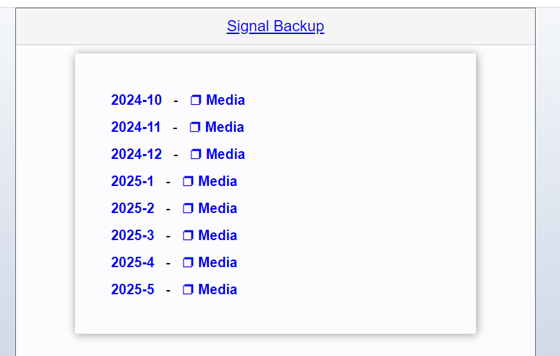
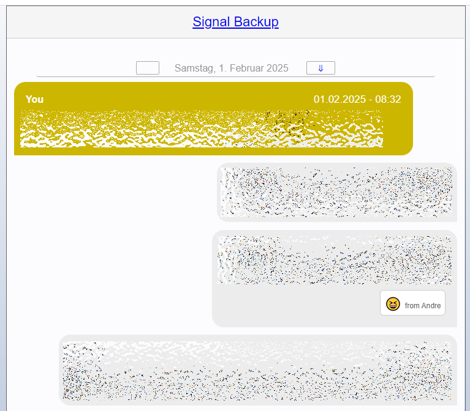

# SignalBackupBeautifier
Creating a HTMLVersion of your Signal Messenger Backup

This is a tool to convert Signal Backups from the 'sigtop' Backup  ( https://github.com/tbvdm/sigtop ) to more readable und 'chat looking' HTML documents.

You need to place the backup (chat.txt) from the chat you want to convert in a folder and a sub folder with the same name as the file with the attachments.
then run "SignalBackupBeautifier.exe X:\Backups\Signal\chat.txt

place a CSS in the folder: style.css (Example in this repository)
you can also place a 'Sticker.png' in the folder. It will be used as a placeholder for emtpy messages, with no attachment, which are most likely a sticker...

Any Questions, feel free.

See LICENSE.txt

If you want to thank someone: Thank the universe ;)
This was build for the one special person, for which the entire universe conspired so that we found each other.

